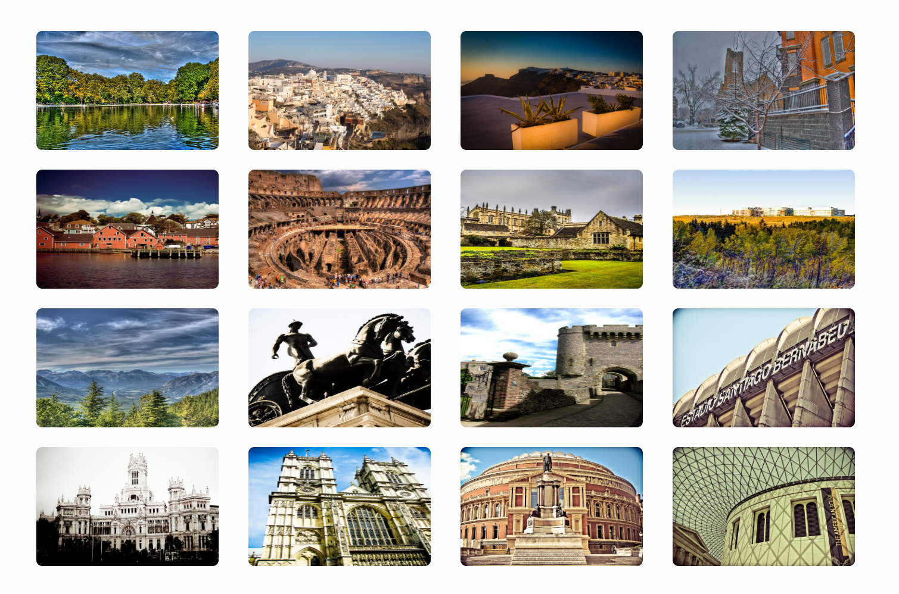
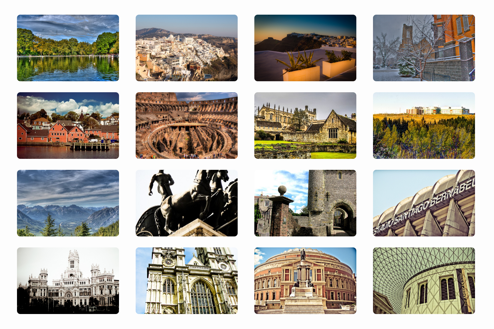

#Web基础应用 PJ1开发文档

**吴逸昕 19302010013**

------------

### 1. Github地址和Github Pages地址
(建议使用Chrome打开)

Github：https://github.com/Shadowlized/PJ1/

Github Pages：https://shadowlized.github.io/PJ1/

------------
### 2. 项目完成情况

本项目基础功能已全部实现，设计中存在的特色如图片、板块边框圆角，阴影，渐变背景色，导航栏颜色渐变动画等等。
            

-------------
### 3. Bonus完成情况

#### 3.1 更复杂的图片处理

该部分已完成，代码样例如下：
```
.table-img {
    width: 100%; height: 100px;
    border-radius: 5px;
    object-fit: cover;
}
```
该代码片段源自`browse`页图片的编排，图片放置在宽高已定的表格中，通过对于`width`与`height`属性的设置已可以达到显示大小一致的效果：
```
.table-img {
    width: 100%; height: 100px;
    border-radius: 5px;
}
```


加上`object-fit: cover`（被替换的内容大小保持其宽高比，同时填充元素的整个内容框，如果对象的宽高比与盒子的宽高比不匹配，该对象将被裁剪以适应）之后：


          

#### 3.2 响应式布局

该部分已大致完成，主要通过将`width`属性设置为百分比与相对值实现

---------------

### 4. 意见与建议

开始上手写PJ的过程还是挺难的，毕竟原订DDL前一两周才刚开始学CSS，在那之前也感到一些无从下手，便一拖再拖，只有到了最近学得差不多了再加上整个PJ大致写完了才感到豁然开朗。我个人认为还是可以再稍稍后延DDL，同时可以加强PJ与知识点之间的衔接（比如罗列一下本次PJ重点会使用哪些元素哪些属性，这样在开始写的时候不会太迷茫）。